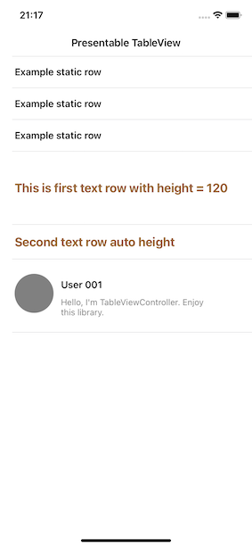

# TableViewController

[](https://travis-ci.org/hosituan/TableViewController)
[](https://cocoapods.org/pods/TableViewController)
[](https://cocoapods.org/pods/TableViewController)
[](https://cocoapods.org/pods/TableViewController)

## Example
To run the example project, clone the repo, and run `pod install` from the Example directory first.

## Requirements
- Swift: 5+
- iOS version: iOS 12.0 or later.
## Installation

TableViewController is available through [CocoaPods](https://cocoapods.org). To install
it, simply add the following line to your Podfile:

```ruby
use_frameworks!

platform :ios, '12.0'

target 'TableViewController_Example' do
  pod 'TableViewController'
end
```
Then, run the following command:
```
$ pod install
```
In your XCode project:
```swift
import TableViewController
```

## Usage
### 1. Conform ViewModel to ```TableViewModel```
```swift
class HomeViewModel: TableViewModel {
    override func buildViewModels() {
        super.buildViewModels()
    }
}
```
### 2. Conform ```UIViewController``` has ```UITableView``` to ```TableViewController``` and set your ```ViewModel```
```swift
import TableViewController
class HomeViewController: TableViewController {
    override func viewDidLoad() {
        super.viewDidLoad()
        // Do any additional setup after loading the view, typically from a nib.
        view.backgroundColor = .white
        title = "Presentable TableView" //Set view title

        //Build viewModel manually. Should be called once finished API request.
        self.viewModel?.buildViewModels()
    }

    override func tableViewModel() -> TableViewModel? {
        return HomeViewModel()
    }
}
```
### 3. Create ```TableViewCell``` conform to ```PresentableTableViewCell``` then ```setupView()```
```swift
class ExampleTextTableViewCell: PresentableTableViewCell {
    override func setupView() {
        super.setupView()
        //Do your cell configuration here
    }
}
```
### 4. Create ```CellRowViewModel``` conform to ```CellPresentable```
```swift
class ExampleTextRowViewModel: CellPresentable {
    var cellIdentifier: String = ExampleTextTableViewCell.className
    var cellHeight: CGFloat
    var index: IndexPath
    
    var text: String?
    init(text: String?, cellHeight: CGFloat = UITableView.automaticDimension, index: IndexPath) {
        self.index = index
        self.cellHeight = cellHeight
        self.text = text
    }
}
```
### 5. Regiester Cell in your ```ViewController``` class
```swift
class HomeViewController: TableViewController {
    override func registerCell() {
        super.registerCell()
        self.tableView.registerCells(ExampleTextTableViewCell.self)
    }
}
```
### 6. Add row model to your ```tableViewModel()```
```swift
class HomeViewModel: TableViewModel {
    override func buildViewModels() {
        super.buildViewModels()
        //MARK: Cell with data, section 0
        //Text row viewModel with fully params
        let firstTextRowModel = ExampleTextRowViewModel(text: "This is first text row with height = 120", cellHeight: 120, index: nextIndex(in: 0))
        self.buildingModels.append(firstTextRowModel)

        //Text row viewModel
        let secondTextRowModel = ExampleTextRowViewModel(text: "This is second text row with auto height", index: nextIndex(in: 0))
        self.buildingModels.append(secondTextRowModel)

        //DO NOT FORGET TO ACCEPT NEW DATA for viewModels
        self.viewModels.accept(buildingModels)
    }
}
```

## Example result screenshot

## Author

hosituan, hosituan.work@gmail.com


Phone/WhatsApp: +84 983 494 681

## License

TableViewController is available under the MIT license. See the LICENSE file for more info.

## Contributing to projects
Feel free to fork and fix! Contribute to hosituan/TableViewController development by creating an account on GitHub.
